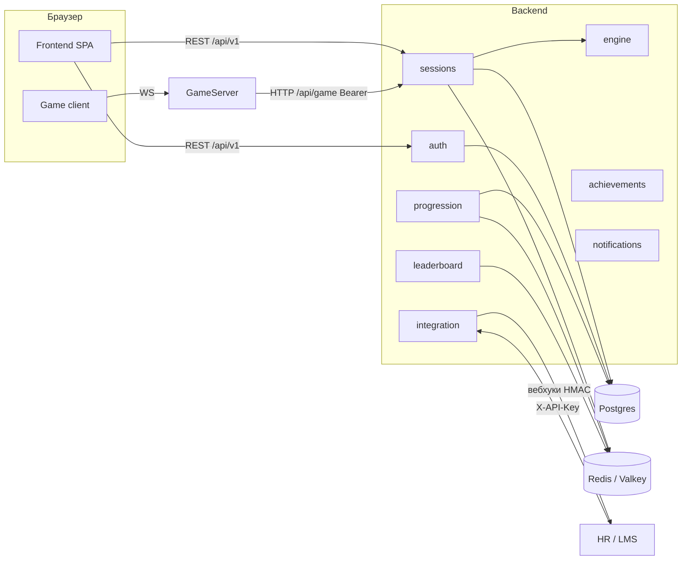
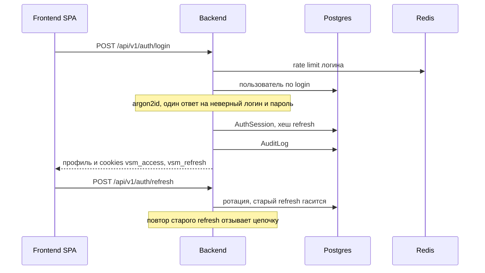
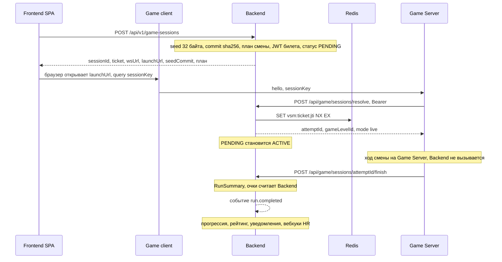

# Архитектура Backend «Перегон»

Каркас: NestJS 11 на Fastify, Prisma 7, Postgres, Redis-клиент, health,
словарь сценария и план смены, событие `run.completed`. Таблица модулей
ниже — границы из SPEC §2. Доменные модули подключаются в той же интеграции,
пустыми папками их нет.

Симуляция живёт в `Game/`: клиент и Game Server. Backend этот протокол не
подменяет. Запуск смены и итог попытки —
[game-server-contract.md](game-server-contract.md).

## Компоненты

Кабинет (`Frontend/`) ходит только в Backend. Игра ходит только в GameServer.
GameServer в Postgres не пишет. Учётки HR заводит сама, саморегистрации нет.

В dev-compose брокер — Valkey 9. Протокол клиентский — Redis (`ioredis`).
Отдельного Redis-сервиса в проде SPEC не требует: тот же URL.

Концепт (`concept.html`) рисовал ещё BullMQ, S3/MinIO, xAPI и Web Push.
В SPEC v1 этого нет: фон — `@nestjs/schedule`, медиа в отдельное хранилище
не выносятся, в LMS уходит вебхук, не xAPI.

## Модули Backend

Глобальный префикс `/api` (`src/configure-app.ts`). Версия URI, по умолчанию
`1`: доменная ручка без своего `version` становится `/api/v1/...`.
`GET /api/health`, `/api/docs`, `/api/openapi.json` вне версии.
Туда же входят `POST /api/game/sessions/resolve` и
`POST /api/game/sessions/:attemptId/finish`: Bearer `GAME_SERVER_TOKEN`,
без префикса `v1`.

| Модуль | Ответственность |
| --- | --- |
| `config` | Схема env (zod). Пустой или короткий секрет роняет процесс до `listen`. |
| `prisma` | Единственная точка записи в Postgres. Адаптер `@prisma/adapter-pg`. |
| `redis` | ZSET рейтинга, jti билетов, rate limit, pub/sub уведомлений (`vsm:notify:<userId>`). |
| `health` | `GET /api/health`: ping Postgres и Redis. |
| `engine` | Словарь сценария и план смены: компетенции, граф, `generateShift`, `validateScenario`, `politenessOf`, HMAC-счётчик `rng`. Без Nest, Prisma, Redis, файлов. Ход симуляции — в Game. |
| `auth` | Логин, ротация refresh, пароль argon2id, игровой билет. Регистрации нет. |
| `users`, `org` | Учётка, депо, бригада. Позывной, не ФИО. |
| `scenarios` | YAML → версия графа в БД. Прогон ссылается на версию. |
| `sessions` | Запуск смены, билет, resolve и finish для Game Server, abort, срок сессии. |
| `progression` | `Run`, леджер очков, уровень, EWMA компетенций, streak. |
| `achievements` | Правила из `content/achievements.yaml`, прогресс, бонус. |
| `leaderboard` | ZSET сезона и копия `SeasonScore`. |
| `notifications` | Запись и SSE `GET /api/v1/notifications/stream`. |
| `analytics` | Теплокарта и пробелы бригады. |
| `cabinet` | Read-API экранов `/me/*`. |
| `integration` | `ApiClient`, сотрудники по `extHash`, вебхуки. |
| `audit` | `AuditLog`: USER, API_CLIENT, SYSTEM, GAME_SERVER. |

`common` — problem+json (RFC 9457) и декораторы доступа, не домен.

## Шина

В процессе один `EventEmitter2`. Подписчики — `@OnEvent(..., { async: true })`,
обработчик идемпотентен по `runId`.

Сейчас в коде объявлено одно имя: `run.completed`
(`src/common/events.ts`). Полезная нагрузка: `runId`, `userId`, `sessionId`,
`summary` (`RunSummary`), `suspicious`.

Дальше по SPEC §8, строго после записи рейса:

1. `progression` — `Run`, `RunDecision`, `PointLedger` (`expiresAt` +30 дней), уровень, EWMA, streak.
2. `achievements` — правила YAML. Коды ачивок из отчёта игры игнорируются.
3. `leaderboard` — `ZINCRBY` в `lb:<season>:brigade:<id>`, `…:depot:<id>`, `…:company`, upsert `SeasonScore`. Подозрительный рейс в рейтинг не идёт.
4. `notifications` — запись и SSE. Сосед снизу по рейтингу получает «вас обогнал».
5. `promotion` — условия грейда → `PromotionRecommendation` (PENDING). Подтверждает человек.
6. `integration` — вебхуки `run.completed`, `achievement.granted`, `promotion.recommended`. Подпись `X-VSM-Signature` (HMAC-SHA256). Повтор — cron, не pub/sub.

Redis pub/sub (`vsm:notify:<userId>`) — доставка уведомления на SSE другой
реплики, не эта шина. Доставка at-most-once. Итог рейса туда не кладётся.

Cron (`@nestjs/schedule`): сгорание баллов раз в час, предупреждение за 3 дня,
закрытие сезона в понедельник 00:00 МСК, ретраи вебхуков. BullMQ в v1 нет.

## Вход

Access — JWT на 15 минут, cookie `vsm_access` (HttpOnly, SameSite=Lax,
Path=/, Secure при `COOKIE_SECURE=true`). Для Swagger и интеграций тот же
токен в `Authorization: Bearer`. Refresh — opaque 32 байта, 7 дней,
cookie `vsm_refresh` (HttpOnly, SameSite=Strict, Path=/api/v1/auth).
В базе лежит хеш, не сам токен.

Учётку создаёт ADMIN или HR. Если в базе нет ни одного ADMIN, старт создаёт
`admin` со случайным паролем (CSPRNG), `mustChangePassword=true`, и один раз
печатает логин, пароль и URL в лог.

## «Играть»

Ход смены считает Game Server. Финал — `finish` с `FinishedGameResult`.
Поля — в `game-server-contract.md`. `POST /api/v1/game-sessions/:id/abort`
ставит сессию `ABORTED` без рейса. Сокет Game этот вызов не закрывает.

Итог с клиента не принимается: нет ручки «вот мои очки».

## Почему источник истины — Backend

Очки, уровень, компетенции, рейтинг, ачивки и рекомендации к грейду пишет
только Backend. Game Server присылает нормализуемый итог `finish`.

Два писателя в ZSET на ретрае засчитают рейс дважды. Поэтому Game Server без
`DATABASE_URL` и без `ZINCRBY`. Повтор `finish` с тем же телом не публикует
`run.completed` второй раз, когда строка `run` уже есть.

Seed смены генерирует сервер (`crypto.randomBytes(32)`). Наружу уходит
`sha256(seed)` как `seedCommit`. Сам seed лежит в `seedEnc` (AES-256-GCM,
ключ `SEED_ENC_KEY`). Публичной ручки раскрытия нет. Разбор
`GET /api/v1/me/runs/:id` отдаёт исход, шкалы и решения, не seed.
Клиентский `Math.random` на результат не влияет.

Срок попытки — `expiresAt`. Раз в минуту просроченные `PENDING` и `ACTIVE`
становятся `EXPIRED`. Дедлайны задач внутри смены считает Game Server.

## Масштабирование

REST-API без состояния в процессе: access-JWT, сессия refresh в Postgres,
jti и лимиты в Redis. Несколько реплик Backend за одним прокси делят Postgres
и Redis. Уведомления между репликами идут pub/sub `vsm:notify:<userId>`.

Game Server держит мир рейса в памяти. Вторая реплика без привязки сокета к
процессу разъедет ревизии. На этот контур — один процесс Game Server.
Горизонтально его не клонируем, пока мир не вынесен из памяти.

`src/engine/` не импортирует Nest и Prisma: это словарь сценария и план смены,
не рантайм хода. Ход симуляции живёт в `Game/`. Общий пакет не заводится.
Граница интеграции — `finish`, см. `game-server-contract.md`.
