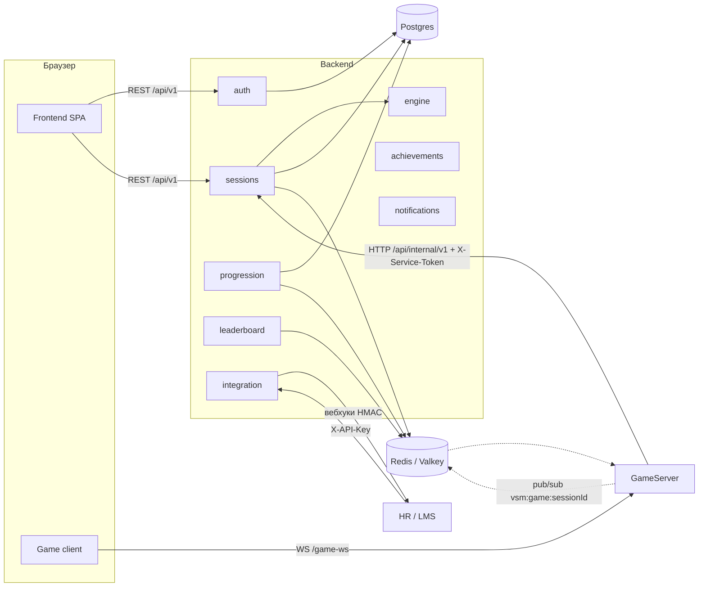
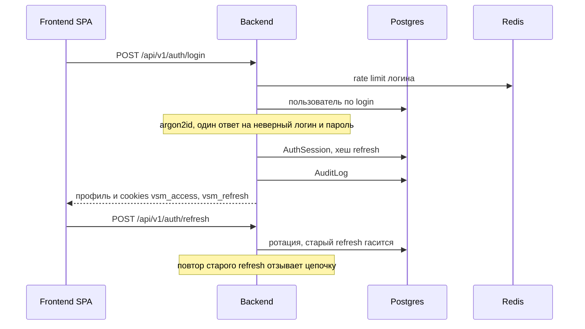
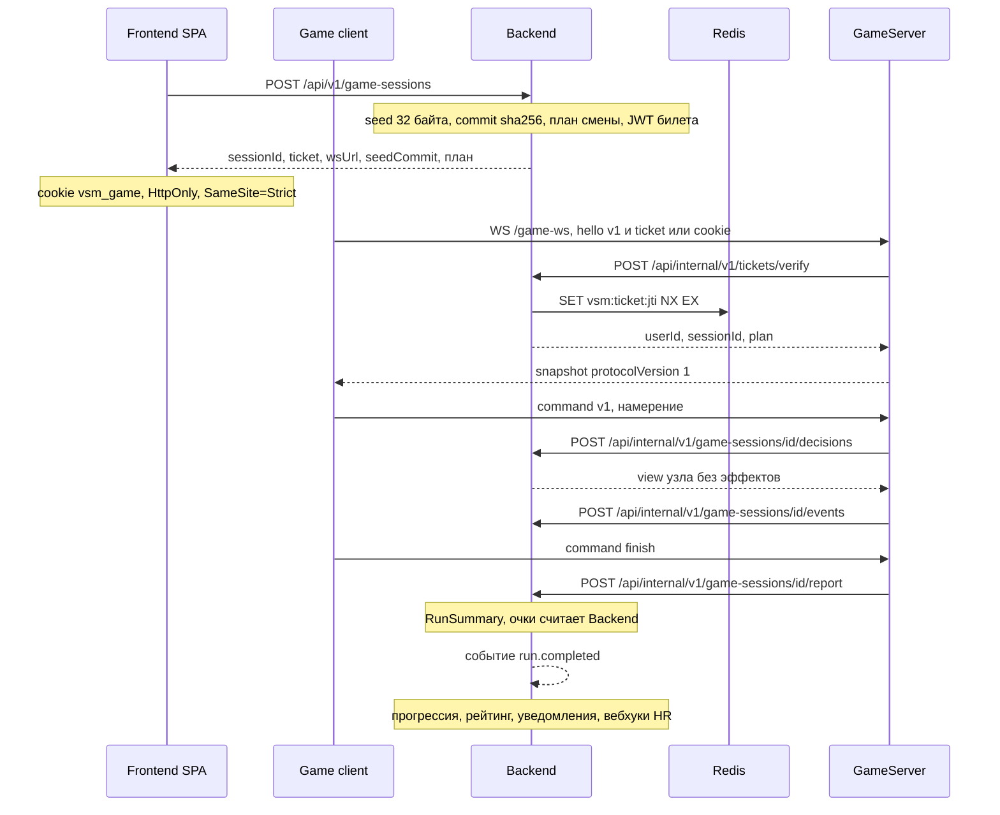
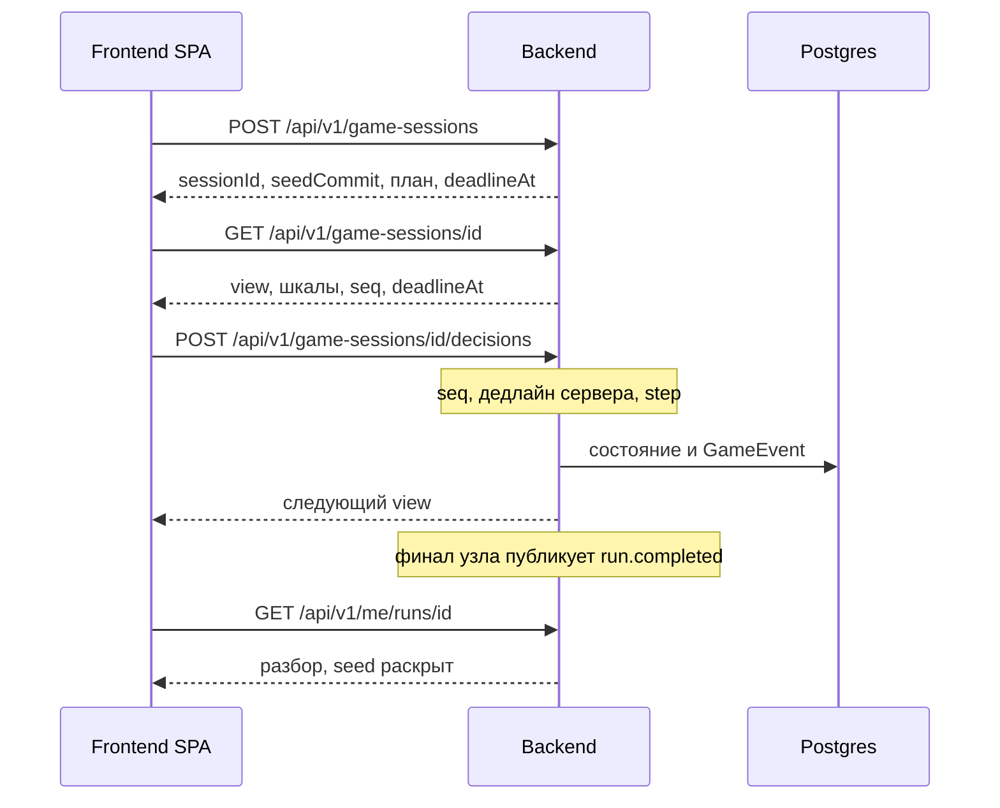

# Архитектура Backend «Перегон»

Каркас этой ветки: NestJS 11 на Fastify, Prisma 7, Postgres, Redis-клиент,
health, схема движка, событие `run.completed`. Таблица модулей ниже — границы
из SPEC §2. Доменные модули подключаются в той же интеграции, пустыми
папками их нет.

GameServer в репозитории нет. Пространственный клиент уже говорит по
WebSocket v1 (`Game/docs/agent/game-websocket-contract.md` на `origin/main`).
Backend этот протокол не подменяет.

## Компоненты

Кабинет (`Frontend/`) ходит только в Backend. Игра ходит только в GameServer.
GameServer в Postgres не пишет. Учётки HR заводит сама, саморегистрации нет.

В dev-compose брокер — Valkey 9. Протокол клиентский — Redis (`ioredis`).
Отдельного Redis-сервиса в проде SPEC не требует: тот же URL.

Концепт (`concept.html`) рисовал ещё BullMQ, S3/MinIO, xAPI и Web Push.
В SPEC v1 этого нет: фон — `@nestjs/schedule`, медиа в отдельное хранилище
не выносятся, в LMS уходит вебхук, не xAPI.

## Модули Backend

Глобальный префикс `/api` (`src/configure-app.ts`). Версия URI, по умолчанию
`1`: доменная ручка без своего `version` становится `/api/v1/...`.
`GET /api/health`, `/api/docs`, `/api/openapi.json` вне версии.
Внутренний API монтируется как `/api/internal/v1/...`
(`VERSION_NEUTRAL`, путь `internal/v1/...`): при обычном `version: '1'`
Nest поставил бы `/api/v1/internal/...`, это не путь SPEC §13.

| Модуль | Ответственность |
| --- | --- |
| `config` | Схема env (zod). Пустой или короткий секрет роняет процесс до `listen`. |
| `prisma` | Единственная точка записи в Postgres. Адаптер `@prisma/adapter-pg`. |
| `redis` | ZSET рейтинга, jti билетов, rate limit, pub/sub. |
| `health` | `GET /api/health`: ping Postgres и Redis. |
| `engine` | Чистый TypeScript: граф сценария, `step`, `view`, `summarize`, HMAC-счётчик. Без Nest, Prisma, Redis, файлов. |
| `auth` | Логин, ротация refresh, пароль argon2id, игровой билет. Регистрации нет. |
| `users`, `org` | Учётка, депо, бригада. Позывной, не ФИО. |
| `scenarios` | YAML → версия графа в БД. Прогон ссылается на версию. |
| `sessions` | Смена, REST-рантайм, билет, internal API для GameServer. |
| `progression` | `Run`, леджер очков, уровень, EWMA компетенций, streak. |
| `achievements` | Правила из `content/achievements.yaml`, прогресс, бонус. |
| `leaderboard` | ZSET сезона и копия `SeasonScore`. |
| `notifications` | Запись и SSE `GET /api/v1/notifications/stream`. |
| `analytics` | Теплокарта и пробелы бригады. |
| `cabinet` | Read-API экранов `/me/*`. |
| `integration` | `ApiClient`, сотрудники по `extHash`, вебхуки. |
| `audit` | `AuditLog`: USER, API_CLIENT, SYSTEM, GAME_SERVER. |

`common` — problem+json (RFC 9457) и декораторы доступа, не домен.

## Шина

В процессе один `EventEmitter2`. Подписчики — `@OnEvent(..., { async: true })`,
обработчик идемпотентен по `runId`.

Сейчас в коде объявлено одно имя: `run.completed`
(`src/common/events.ts`). Полезная нагрузка: `runId`, `userId`, `sessionId`,
`summary` (`RunSummary`), `suspicious`.

Дальше по SPEC §8, строго после записи рейса:

1. `progression` — `Run`, `RunDecision`, `PointLedger` (`expiresAt` +30 дней), уровень, EWMA, streak.
2. `achievements` — правила YAML. Коды ачивок из отчёта игры игнорируются.
3. `leaderboard` — `ZINCRBY` в `lb:<season>:brigade:<id>`, `…:depot:<id>`, `…:company`, upsert `SeasonScore`. Подозрительный рейс в рейтинг не идёт.
4. `notifications` — запись и SSE. Сосед снизу по рейтингу получает «вас обогнал».
5. `promotion` — условия грейда → `PromotionRecommendation` (PENDING). Подтверждает человек.
6. `integration` — вебхуки `run.completed`, `achievement.granted`, `promotion.recommended`. Подпись `X-VSM-Signature` (HMAC-SHA256). Повтор — cron, не pub/sub.

Redis pub/sub (`vsm:game:<sessionId>`) — не эта шина. Это сигнал GameServer
(отмена сессии). Доставка at-most-once: кто не был подписан, сообщение не
догонит. Итог рейса туда не кладётся.

Cron (`@nestjs/schedule`): сгорание баллов раз в час, предупреждение за 3 дня,
закрытие сезона в понедельник 00:00 МСК, ретраи вебхуков. BullMQ в v1 нет.

## Вход

Access — JWT на 15 минут, cookie `vsm_access` (HttpOnly, SameSite=Lax,
Path=/, Secure при `COOKIE_SECURE=true`). Для Swagger и интеграций тот же
токен в `Authorization: Bearer`. Refresh — opaque 32 байта, 7 дней,
cookie `vsm_refresh` (HttpOnly, SameSite=Strict, Path=/api/v1/auth).
В базе лежит хеш, не сам токен.

Учётку создаёт ADMIN или HR. Если в базе нет ни одного ADMIN, старт создаёт
`admin` со случайным паролем (CSPRNG), `mustChangePassword=true`, и один раз
печатает логин, пароль и URL в лог.

## «Играть» через GameServer

Диалоговый перегон и пространственная симуляция — разные входы в один итог.
Решения перегона GameServer проводит через `decisions`. Окончание симуляции —
`report` с `RunReport` v1. Оба пути публикуют `run.completed`. Подробности
полей — в `game-server-contract.md`.

Канал `vsm:game:<sessionId>`: Backend публикует отмену, GameServer закрывает
сокет. Подписчик, которого не было в момент `PUBLISH`, кадр не получит.

## REST без GameServer

Тот же движок, транспорт `REST`. Клиент кабинета или тонкий клиент.

`POST .../abort` снимает сессию. Опоздание относительно `nodeDeadlineAt`
(допуск 500 мс на сеть) — переход `timeout`, не ошибка HTTP. Повтор того же
`seq` возвращает тот же ответ. Другой `seq`, чем ждёт сервер, — 409.
Чужая сессия — 404. Выбор с невыполненным `requires` — 422
`CHOICE_NOT_AVAILABLE`.

Итог с клиента не принимается: нет ручки «вот мои очки».

## Почему источник истины — Backend

Очки, уровень, компетенции, рейтинг, ачивки и рекомендации к грейду пишет
только Backend. Клиент и GameServer присылают намерение или нормализуемый
отчёт. `view()` не отдаёт эффекты, вердикт и `better` до разбора.

Два писателя в ZSET на ретрае засчитают рейс дважды. Поэтому GameServer без
`DATABASE_URL` и без `ZINCRBY`. Повтор `report` по тому же `sessionId` не
публикует `run.completed` второй раз.

Seed смены генерирует сервер (`crypto.randomBytes(32)`). Наружу уходит
`sha256(seed)`. Сам seed лежит в `seedEnc` (AES-256-GCM, ключ `SEED_ENC_KEY`)
и раскрывается в разборе. Клиентский `Math.random` на результат не влияет.

Дедлайн диалогового узла — `nodeDeadlineAt` в базе. Часы телефона не
продлевают ход. В симуляции мягкий и жёсткий дедлайн задачи считает
GameServer в игровых секундах; клиент только рисует HUD (контракт v1).

## Масштабирование

REST-API без состояния в процессе: access-JWT, сессия refresh в Postgres,
jti и лимиты в Redis. Несколько реплик Backend за одним прокси делят Postgres
и Redis. Pub/sub для отмены сессии при двух репликах API достаточен: сообщение
не хранит мир.

GameServer держит мир рейса в памяти. Вторая реплика без привязки сокета к
процессу разъедет ревизии. На этот контур — один процесс GameServer.
Горизонтально его не клонируем, пока мир не вынесен из памяти.

`src/engine/` не импортирует Nest и Prisma, чтобы позже отдать `step()`
процессу GameServer. Общий пакет не заводится, пока этот процесс не появился:
так сказано в `docs/user/project_direction.md`. Доменная логика самой игры
пока живёт в `Game/` и в рантайм сцены не вшита; границей интеграции служит
`RunReport`, а не общий package.
