# Диаграммы архитектуры Game

**Версия документа:** 0.1.0
**Статус:** Handoff / current implementation
**Дата редакции:** 2026-09-27

## 1. Назначение

Этот документ является визуальной картой текущей реализации `Game` для передачи серверной части другому разработчику.

Диаграммы показывают фактические границы текущего release-кода. Deferred/baseline возможности не изображаются как уже реализованные, если они не нужны для понимания extension point.

Основные текстовые контракты остаются нормативными:

- [`repository-structure.md`](repository-structure.md) — направление зависимостей;
- [`client-server.md`](client-server.md) — Browser ↔ Game Server ↔ Platform Server;
- [`../api/websocket-protocol.md`](../api/websocket-protocol.md) — wire protocol v1;
- [`platform-contract.md`](platform-contract.md) — Platform API semantics;
- [server logging](../deployment/server-configuration.md#9-logging) — structured diagnostics.

## 2. System context

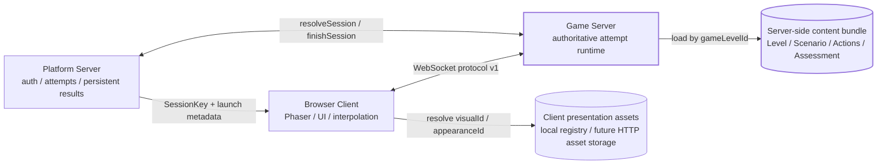

### Ownership

- Platform Server владеет пользовательской авторизацией, созданием попытки и постоянным результатом.
- Game Server владеет authoritative runtime конкретной попытки.
- Browser Client владеет только presentation/input state.
- Server-side content задаёт конфигурацию уровня и сценария, но не переносится целиком в browser.

## 3. Архитектурные слои приложения

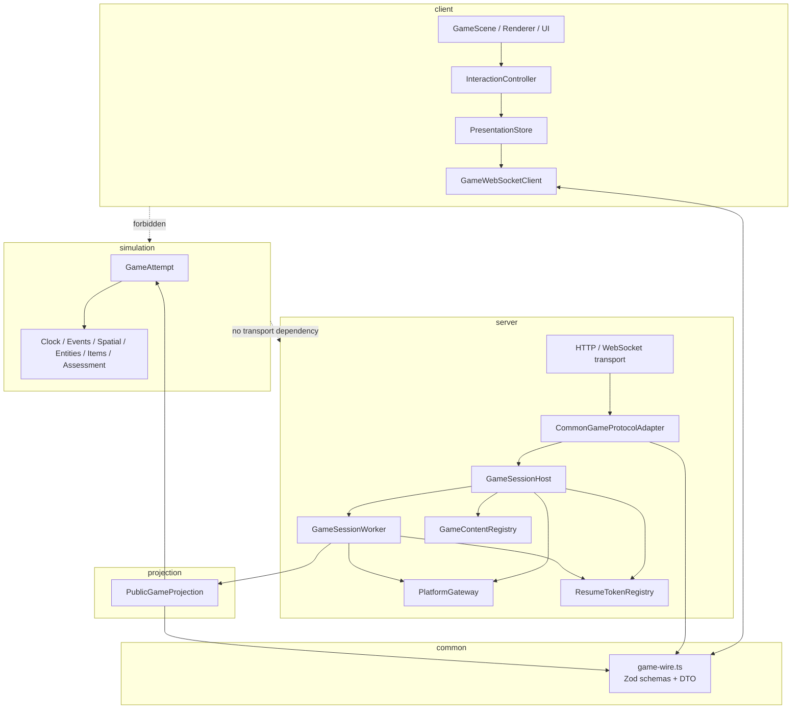

Ключевая граница — `projection`. Это безопасное промежуточное звено между private authoritative state и browser-facing DTO. `server` управляет lifecycle/transport, но не должен сериализовать внутреннее состояние simulation напрямую.

## 4. Внутренняя архитектура Game Server

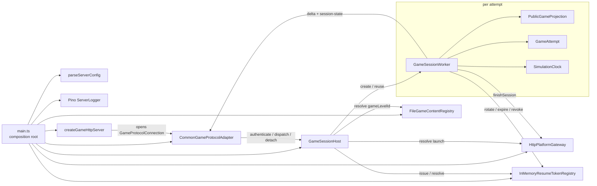

`GameSessionWorker` принадлежит `attemptId`, а не WebSocket. Соединение может исчезнуть и появиться снова, пока worker сохраняет authoritative attempt в пределах reconnect lifecycle.

## 5. Запуск и reconnect сессии

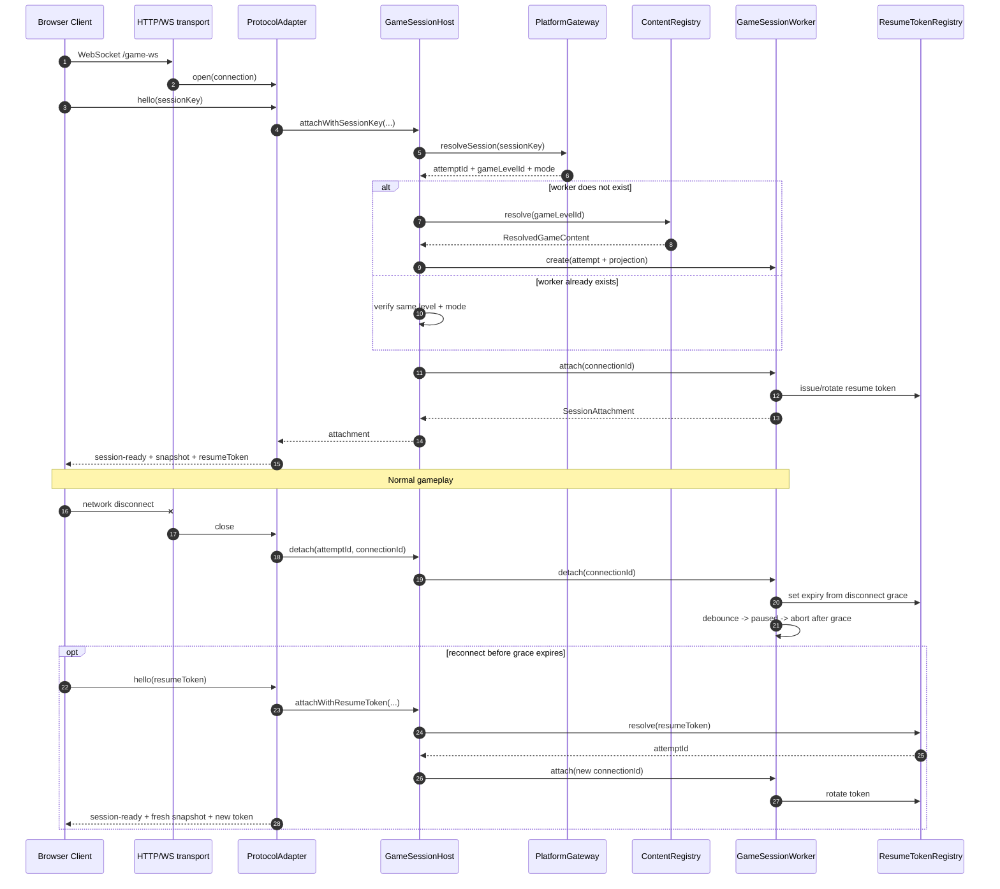

## 6. Обработка команды и public projection

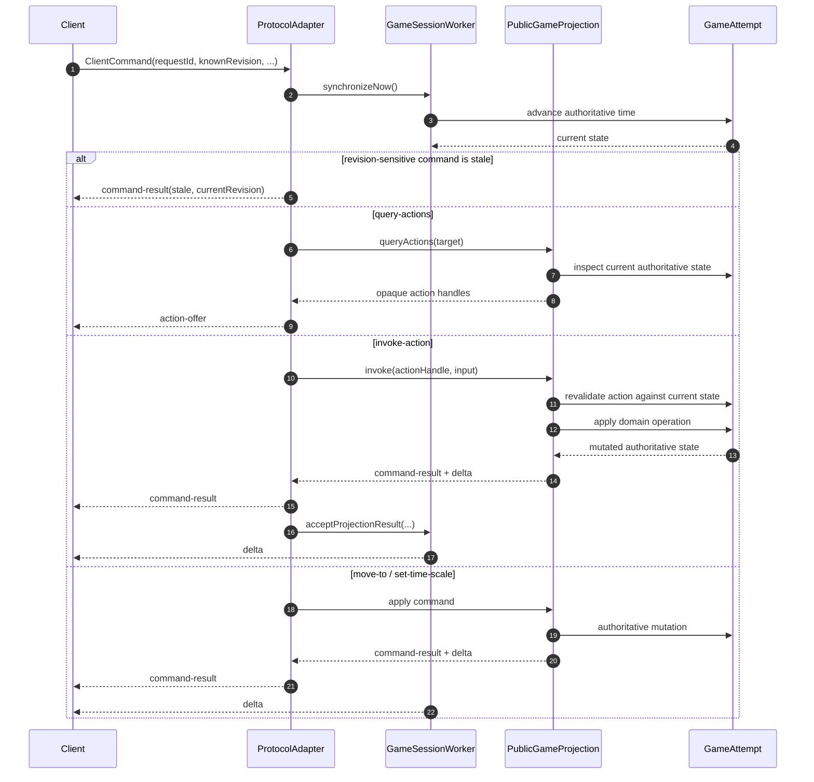

Инварианты интеграции:

1. Client передаёт intent, а не готовое изменение domain state.
2. `knownRevision` защищает revision-sensitive операции от применения к заведомо устаревшему public state.
3. `actionHandle` opaque и повторно авторизуется при `invoke`, даже если public revision формально не изменилась.
4. Authoritative mutation происходит до построения нового public projection.
5. Для accepted mutation клиент получает `command-result`, затем public `delta`.

## 7. `move-to`: дальняя цель и промежуточные delta

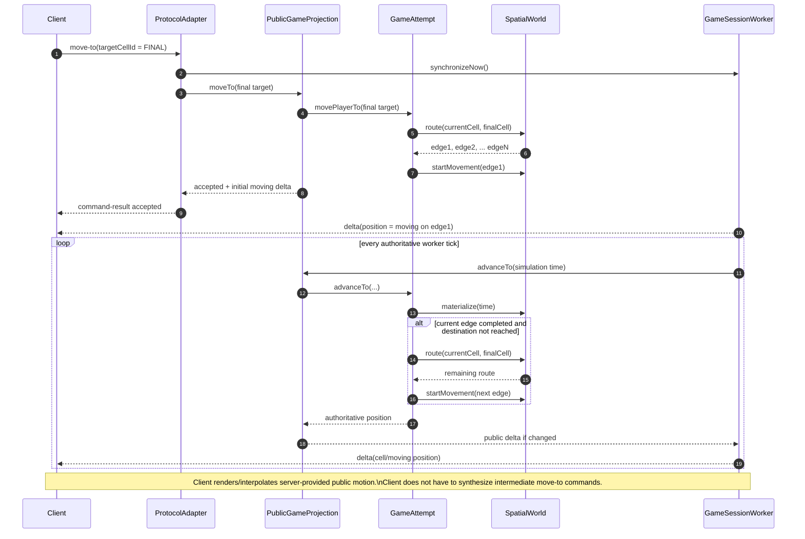

Если маршрут после промежуточной клетки больше недоступен, authoritative movement прекращается в последней достигнутой клетке; worker/tick не должен аварийно останавливаться из-за невозможности продолжить route.

## 8. Lifecycle попытки

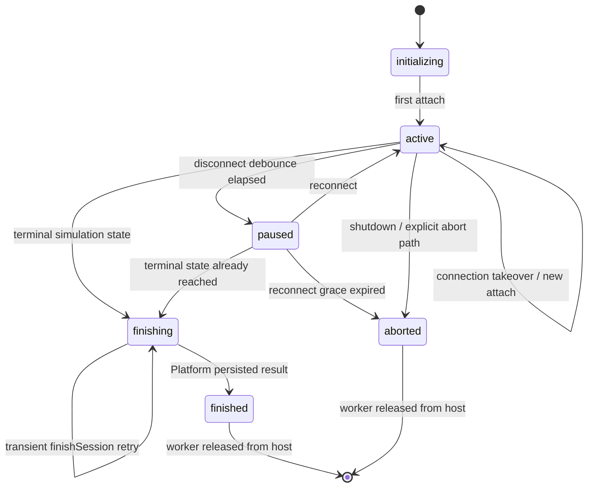

Connection lifecycle существует отдельно:

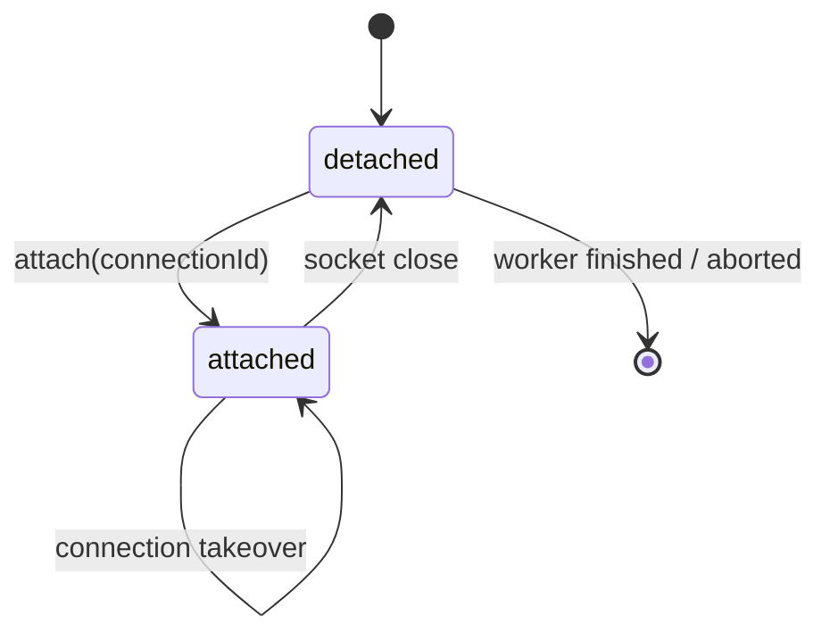

## 9. Class diagram: server + projection

Диаграмма показывает важные runtime relationships, а не каждый private helper.

```mermaid
classDiagram
    direction LR

    class GameSessionHost {
      -Map~attemptId, HostedWorker~ workers
      +attachWithSessionKey(sessionKey, connectionId) Promise~SessionAttachment~
      +attachWithResumeToken(resumeToken, connectionId) SessionAttachment
      +detach(attemptId, connectionId) void
      +worker(attemptId) GameSessionWorker
      +shutdown() void
    }

    class GameSessionWorker {
      -AttemptLifecycle lifecycleState
      -ConnectionLifecycle connectionState
      -SimulationClock simulationClock
      -RecordedGameplayCommand[] userInputs
      +projection PublicGameProjection
      +synchronizeNow() void
      +setTimeScale(scale) GameDeltaMessage
      +recordUserInput(command) void
      +attach(connectionId) SessionAttachment
      +detach(connectionId) void
      +subscribePublications(listener) unsubscribe
      +acceptProjectionResult(result) void
      +shutdown() void
    }

    class CommonGameProtocolAdapter {
      +open(connection) void
      +shutdown() void
      -dispatchAuthenticated(...) void
      -sendInvokeResult(...) void
    }

    class GameProtocolConnection {
      <<interface>>
      +onMessage(listener)
      +onClose(listener)
      +send(data)
      +close(code, reason)
    }

    class PlatformGateway {
      <<interface>>
      +resolveSession(sessionKey) Promise~ResolvedPlatformSession~
      +finishSession(attemptId, result) Promise~FinishSessionResponse~
    }

    class HttpPlatformGateway {
      +resolveSession(sessionKey)
      +finishSession(attemptId, result)
    }

    class GameContentRegistry {
      <<interface>>
      +resolve(gameLevelId) ResolvedGameContent
    }

    class FileGameContentRegistry {
      +resolve(gameLevelId) ResolvedGameContent
    }

    class ResumeTokenRegistry {
      <<interface>>
      +issue(attemptId) string
      +expireAttemptAt(attemptId, expiresAtMs) void
      +resolve(token, nowMs) string
      +revokeAttempt(attemptId) void
    }

    class InMemoryResumeTokenRegistry

    class PublicGameProjection {
      -revisionValue number
      -actionHandles RuntimeAction[]
      +snapshot(clock) GameSnapshotMessage
      +advanceTo(target, clock) GameDeltaMessage
      +refresh(clock) GameDeltaMessage
      +moveTo(command, clock) InvokeResult
      +queryActions(command) ActionOfferMessage
      +invoke(command, clock) InvokeResult
      +applyReplayCommand(command, clock) InvokeResult
    }

    class GameAttemptPort {
      <<interface>>
      +termination AttemptTermination
      +snapshot() GameAttemptSnapshot
      +assessmentResult() AssessmentResult
    }

    CommonGameProtocolAdapter --> GameSessionHost : auth / dispatch
    CommonGameProtocolAdapter --> GameProtocolConnection : owns connection state
    GameSessionHost *-- GameSessionWorker : one per attemptId
    GameSessionHost --> PlatformGateway : resolveSession
    GameSessionHost --> GameContentRegistry : resolve level content
    GameSessionHost --> ResumeTokenRegistry : resume lookup
    GameSessionWorker --> PlatformGateway : finishSession
    GameSessionWorker --> ResumeTokenRegistry : token lifecycle
    GameSessionWorker *-- PublicGameProjection : public boundary
    GameSessionWorker --> GameAttemptPort : authoritative attempt
    PublicGameProjection --> GameAttemptPort : reads / invokes domain state

    PlatformGateway <|.. HttpPlatformGateway
    GameContentRegistry <|.. FileGameContentRegistry
    ResumeTokenRegistry <|.. InMemoryResumeTokenRegistry
```

## 10. Class diagram: simulation core

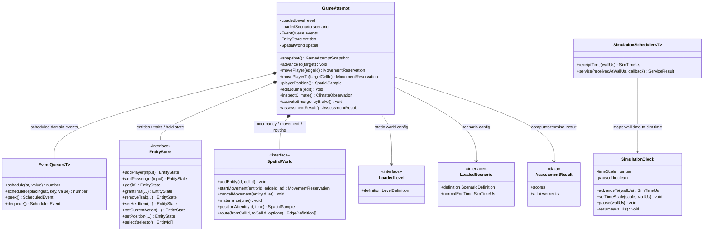

`GameAttempt` является основным domain aggregate. Детали items, field/environment runtime, NPC decisions и action runtime находятся внутри simulation слоя и не экспортируются напрямую в transport.

## 11. Данные и trust boundaries

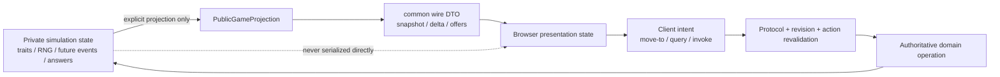

При расширении сервера безопаснее всего сохранять эту форму: новый private state сначала появляется в simulation, затем явно выбирается его public representation в projection и только после этого попадает в `common`/wire schema.

## 12. Где искать код

| Зона | Основные файлы |
|---|---|
| composition/config | `src/server/main.ts`, `src/server/config.ts` |
| HTTP/WebSocket transport | `src/server/http-server.ts` |
| wire command dispatch | `src/server/protocol-adapter.ts` |
| attempt registry/auth/reconnect | `src/server/session-host.ts`, `src/server/resume-token-registry.ts` |
| wall-time/tick/finalization | `src/server/game-session-worker.ts` |
| Platform integration | `src/server/platform-gateway.ts`, `src/server/types.ts` |
| content loading | `src/server/content-registry.ts` |
| public state/action boundary | `src/projection/public-game-session.ts` |
| authoritative aggregate | `src/simulation/game-attempt.ts` |
| spatial routing/movement | `src/simulation/spatial-world.ts` |
| entities/traits | `src/simulation/entity-store.ts` |
| event ordering | `src/simulation/event-queue.ts` |
| Browser transport/store/input | `src/client/network/`, `src/client/presentation/`, `src/client/input/` |
| shared schemas | `src/common/game-wire.ts` |
